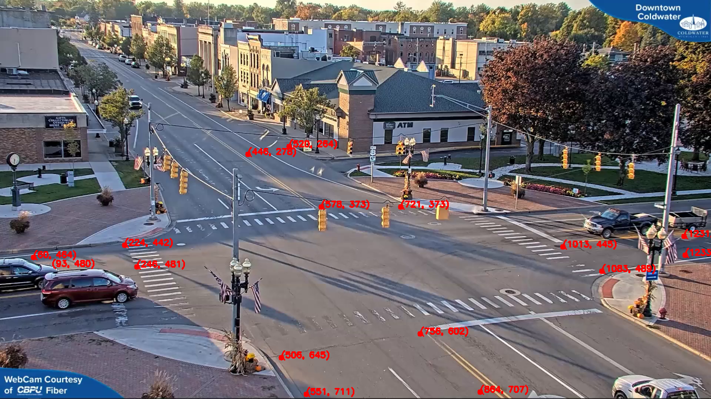
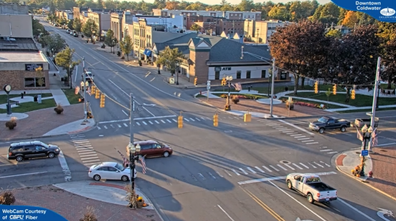
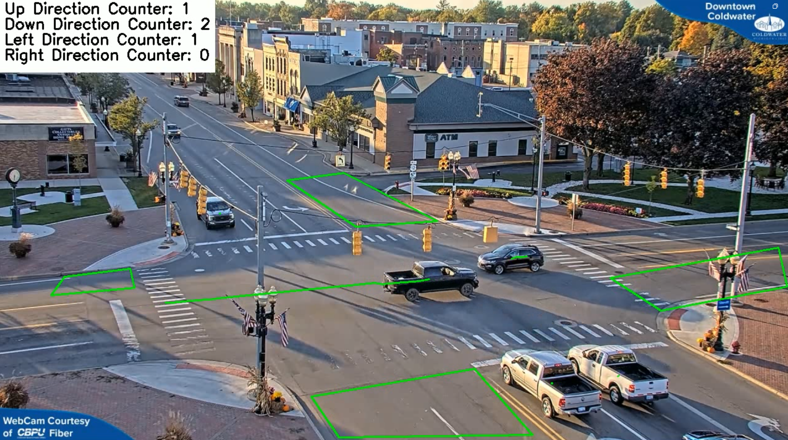

# Direction Detection and Tracking

This project is developed to detect and count vehicle directions at an intersection using YOLOv8. It tracks vehicle movements in upward, downward, left, and right directions.

## Features
- Tracks vehicle directions within predefined ROI regions at an intersection.
- Performs object detection using YOLOv8.
- Draws past positions of moving vehicles.
- Counts vehicles moving in different directions and displays the count in the top-left corner.
- Saves the output video.

## Requirements
The following libraries must be installed:
```bash
pip install opencv-python numpy ultralytics imutils
```

## Usage
### 1. ROI Selection
First, define the ROI (Region of Interest) areas where vehicles will be detected at the intersection. Run the `ROI_SELECTION.py` file:
```bash
python ROI_SELECTION.py
```
- Once the video opens, select ROI points using your mouse.
- Press `Esc` to save the selection as `roi.png`.



### 2. Vehicle Tracking and Direction Detection
After selecting the ROI, run the main script:
```bash
python main.py
```
This script:
- Detects vehicles using YOLOv8.
- Tracks vehicle movements.
- Counts vehicles moving in upward, downward, left, or right directions.
- Saves the output video as `result/video.avi`.

**Recommended Image:** An example frame showing vehicle directions at an intersection.

## Working Principle
1. **ROI Selection:** The user defines the areas to be monitored at the intersection.
2. **Object Detection:** YOLOv8 detects vehicles.
3. **Tracking and Counting:** The movement of vehicles is tracked, and their direction is determined.
4. **Visualization of Results:** Counters for each direction are displayed on the screen, and an output video is generated.

## Output
When the project runs, you will see an output like this:
```
Up Direction Counter: 3
Down Direction Counter: 5
Left Direction Counter: 2
Right Direction Counter: 4
```

## Example Output Images





## Model
This project uses the **YOLOv8n.pt** model. Different YOLO models can be used for better accuracy.

## Future Improvements
- Automatic ROI detection for different intersections.
- Improved accuracy using larger YOLO versions.
- Counting vehicle types for detailed analysis.
- Time-based traffic density analysis.

---
This project is developed to analyze traffic flow at intersections and track vehicle directions. Feel free to share your feedback and suggestions! 🚀

## LinkedIn
Check out my other projects on my LinkedIn profile: [LinkedIn Profile](https://www.linkedin.com/in/ahmet-yasir-duman-03b689256)

## Author

Ahmet Yasir Duman

GitHub: https://github.com/ahmetduman23?tab=repositories
