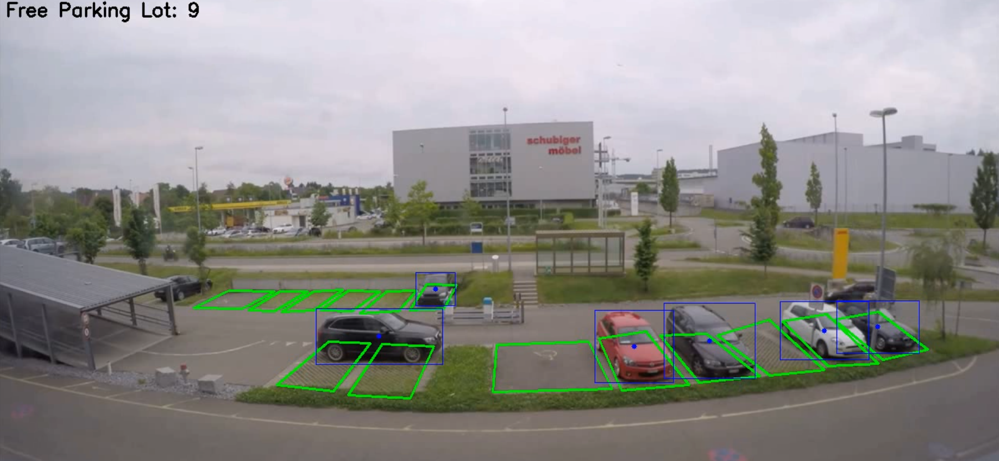

# Parking Space Detection using YOLO12n

This project is developed to detect and count empty parking spaces using YOLO12n. It identifies vehicles in predefined parking slots and determines available parking spots in real time.

## Features
- Detects vehicles using the YOLO12n object detection model.
- Identifies occupied and free parking spaces.
- Displays real-time parking availability on the video.
- Tracks vehicle positions within parking areas.
- Saves the processed video with detections.

## Requirements
Ensure you have the following dependencies installed:

```bash
pip install opencv-python numpy ultralytics imutils
```

## Usage
### 1. Video Input
Place your video file in the `inference/` directory and update the `video_path` variable in the script.

### 2. Running the Detection
Run the main script:
```bash
python main.py
```
This script:
- Loads the YOLO12n model.
- Detects vehicles in each frame.
- Checks whether vehicles are inside predefined parking polygons.
- Counts free and occupied parking spaces.
- Displays and saves the output video with real-time results.

## Output
When the project runs successfully, it displays the number of free parking lots:
```
Free Parking Lot: 10
Free Parking Lot: 9
...
```
The processed video is saved as `result/video.avi`.

## Example Output Images


## Future Improvements
- Implementing automatic parking slot detection.
- Enhancing accuracy with higher-capacity YOLO models.
- Integrating a web-based dashboard for live monitoring.
- Generating statistical reports for parking utilization analysis.

---
This project aims to optimize parking space detection using computer vision. Your feedback and contributions are welcome! 🚀

## LinkedIn
Check out my other projects on my LinkedIn profile: [LinkedIn Profile](https://www.linkedin.com/in/ahmet-yasir-duman-03b689256)

## Author
Ahmet Yasir Duman  
GitHub: [GitHub Profile](https://github.com/ahmetduman23?tab=repositories)
