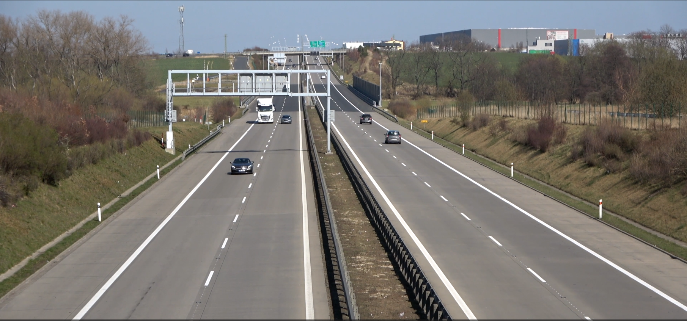
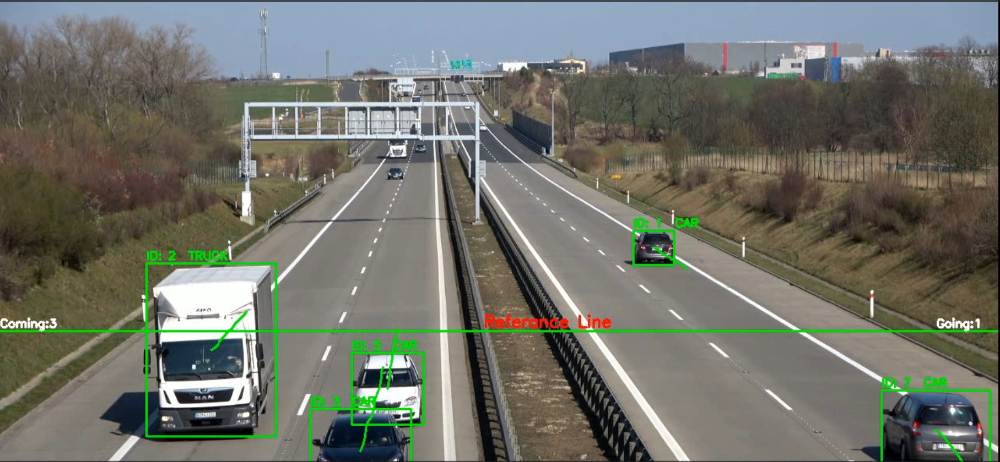

# Highway Car Counting

This project detects vehicles on the road using the YOLOv8 object detection model and counts them based on their travel direction.

## 📌 Features
- Vehicle detection using YOLOv8
- Counting "Outgoing" and "Incoming" vehicles separately based on movement direction
- Generating an output video
- Visualization and reference line drawing with OpenCV

## 🚀 Installation & Usage

### 1️⃣ Install Dependencies
Run the following commands in your terminal to install the required Python libraries:

```bash
pip install ultralytics opencv-python numpy imutils
```

### 2️⃣ Run the Project
Use the following command to run the script:

```bash
python main.py
```

### 3️⃣ Used Files
- **`models/yolov8n.pt`** → Pre-trained YOLOv8 model
- **`inferance/test.mp4`** → Input video (Containing vehicles to be detected)
- **`result/video.avi`** → Output video (With detected and counted vehicles)

## 🎯 Working Principle
1. The input video is read and processed using the YOLOv8 model.
2. Vehicle midpoints are tracked to detect those crossing the reference line.
3. "Outgoing" and "Incoming" vehicles are counted separately and displayed on the screen.
4. An output video is generated.

## 📌 Example Outputs

**Input Video:**  



**Output Video:**  


## 🛠️ Requirements
- Python 3.8+
- OpenCV
- YOLOv8
- NumPy
- imutils

## 📌 License
This project is open-source and available for personal and academic use.

---

**Note:** Feel free to share your feedback about the project! 🚀

## LinkedIn
Check out my other projects on my LinkedIn profile: [LinkedIn Profile](https://www.linkedin.com/in/ahmet-yasir-duman-03b689256)

## Author

Ahmet Yasir Duman

GitHub: https://github.com/ahmetduman23?tab=repositories
